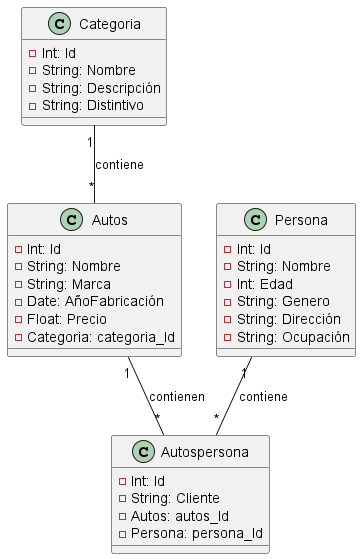

# Parcial Analisis de sistemas. Sorteo Autos

### Necesidad: Se tiene una inmobliliaria de autos donde se realizara un sorteo y se va a construir un sistema que permita llevar el registro con la siguientes datos; Categoría que lleve un `Id`, `nombre `, `estilo` y `eficiencia`.Autos con `Id`, `nombre`, `marca`, , `precio` y `ref: Categoria de carros`. AutosPersona `Id`, `usuario`, `ref: Autos`, `ref: Persona`. Persona `Id`, `nombre`, `edad`, `cedula` y `Profesion`. En el cual una relación de un Auto tiene su respectiva Categoria de carros y una relación de AutosPersona con Autos y Persona.  

#### Análisis: Definición de requerimientos. 

* Categoria {Id, nombre, estilo, eficiencia}
* Autos{Id, nombre, marca, color, precio, ref:categoria}
* AutosPersona {Id, usuario, ref:Autos, ref:persona}
* Persona {Id, nombre, edad, cedula y profesion}

1. RF1: Realizar la CRUD de categoria, donde se requiere la siguiente estructura de la entidad : `categorria {Id, nombre, direccion, cedula}`.
- No puede existir un auto con el mismo Id
2. RF2: Realizar la CRUD de Autos que lleve la siguiente estructura: `Autos{Id, nombre, marca, color, precio, ref:categoria}`. 
3. RF3: Realizar la CRUD de AutosPersona con la siguiente estructura: `AutosPersona {Id, usuario, ref:Autos, ref:persona}`.
4. RF4: Realizar la CRUD de Persona con la siguiente estructura: `Persona {Id, nombre, edad, cedula y profesion}`.

#### Diseñar Base de datos
`Catagoria`

|Id|    Nombre     |                       Estilo                        |              Eficiencia                      |
|--|---------------|-----------------------------------------------------|----------------------------------------------|
|1 |Electrico      |Diseñados con motores electricos                     |Es un auto muy atractivo.
|2 |Deportivo      |Diseñados para altas velocidades                     |Es un auto que aporta lujo.     
|3 |Crossover      |Diseñados con estructuras de varios vehiculos        |Autos de alta potencia.

`Autos`

|Id|         Nombre       |    Marca     |  Color          |    Precio   | Categoria    | 
|--|----------------------|--------------|-----------------|-------------|--------------|
|1 |Alfa Romeo            |Alfa Romeo    |     Negro       | USD76.100   |      1       |
|2 |Ferrari               |Ferrari       |     Verde       | USD 4,695   |      2       |
|3 |cadillac              |Cadillac      |     Amrillo     | USD 435.200 |      3       |

`Persona`

|Id|     Nombre     | Edad | Cedula     | Profesion | 
|--|----------------|------|------------|-----------|
|1 | Piedad Ramirez |  29  |1003875623  |  Medica   |
|2 | Efrain Perez   |  26  |1004532677  | Futbolista|
|3 | Pedro Gonzales |  34  |1005673367  | Ingeniero |
|4 | Sergio Perez   | 25   |1004767636  | Arquitecto|

`AutosPersona`

|Id|   Usuario | Autos Id | Persona Id |
|--|-----------|----------|------------|
|1 | Usuario 1 |     1    |     3      |
|2 | Usuario 2 |     2    |     2      |
|3 | Usuario 3 |     3    |     1      |

>Ver

*Script de la base de datos

     DROP DATABASE IF EXISTS Concesionario;

     CREATE DATABASE Concesionario;
     
     USE Concesionario; 

     CREATE table Categoria (
        Id INT NOT NULL PRIMARY KEY AUTO_INCREMENT,
        Nombre VARCHAR (50) NOT NULL,
        Estilo VARCHAR (50) NOT NULL,
        Eficiencia VARCHAR (50) NOT NULL
     );

     CREATE table Autos(
        Id INT NOT NULL PRIMARY KEY AUTO_INCREMENT,
        Nombre VARCHAR (50) NOT NULL,
        Marca VARCHAR (50) NOT NULL,
        Color VARCHAR(50) NOT NULL,
        Precio float NOT NULL,
        categoria_Id INT NOT NULL,
        FOREING KEY (categoria_Id) REFERENCES Categoria(Id)
     );

     CREATE table Persona(
        Id INT NOT NULL PRIMARY KEY AUTO_INCREMENT,
        Nombre VARCHAR(50) NOT NULL,
        Edad INT NOT NULL,
        Cedula VARCHAR(50) NOT NULL,
        Profesion VARCHAR(50) NOT NULL,
     );

     CREATE table AutosPersona(
        Id INT NOT NULL PRIMARY KEY AUTO_INCREMENT,
        Usuario VARCHAR(50) NOT NULL,
        autos_Id INT NOT NULL,
        persona_Id INT NOT NULL,
        FOREING KEY (autos_Id) REFERENCES Autos(Id)
        FOREING KEY (persona_Id) REFERENCES Persona(Id)
     );

## Ver planificación 
[ver aqui](https://trello.com/b/D5V5rtHN/parcial)